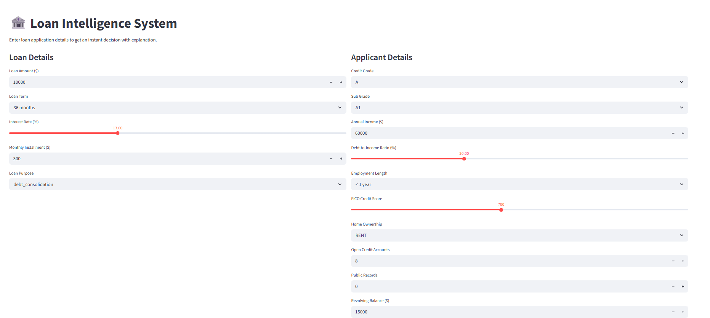
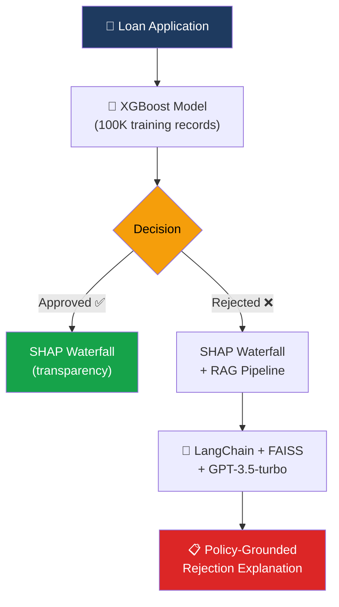
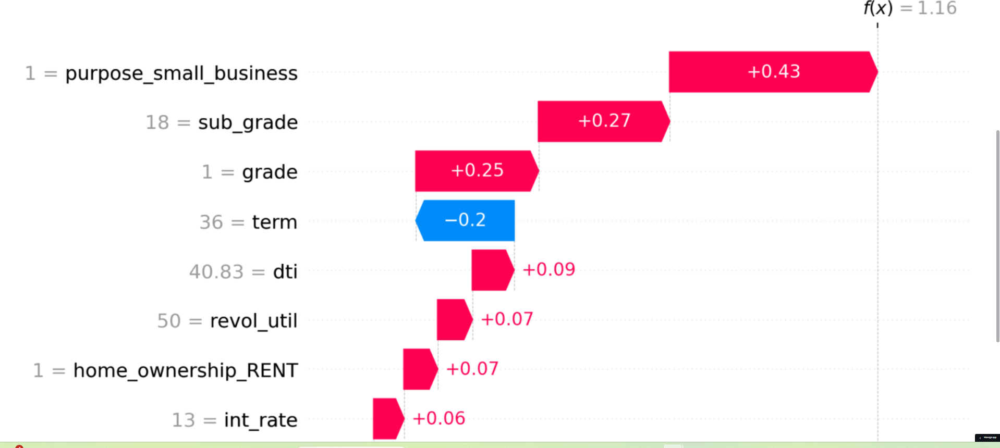
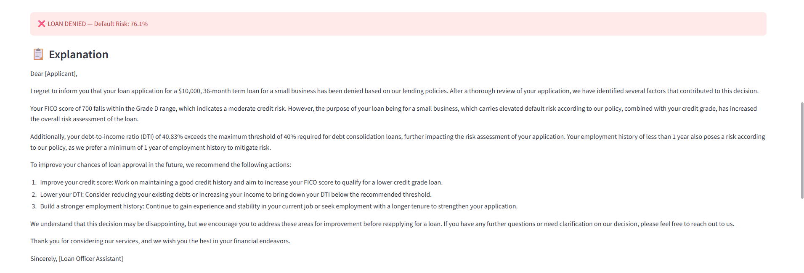

<div align="center">

# 🏦 Loan Intelligence System

**An end-to-end credit risk assessment system combining XGBoost predictions, SHAP explainability, and a RAG-powered LLM for policy-grounded rejection explanations.**

[](https://loan-intelligence-system-6vbtpbunxh7yvf5neajhva.streamlit.app/)
[](https://python.org)
[](https://xgboost.readthedocs.io/)
[](https://shap.readthedocs.io/)
[](https://www.langchain.com/)

> Enter a loan application → get an instant decision with **full transparency**: which features drove the prediction, and a **policy-grounded explanation** of why.

</div>

---

<p align="center">
  
</p>

---

## 🎯 The Problem

Credit decisions need to be **explainable**. Under GDPR (Article 22) and EBA guidelines, financial institutions must provide meaningful explanations for automated decisions. A black-box model that says "rejected" without explaining why is **not deployable** in the European financial sector.

This system solves three problems at once:

| Problem | Solution |
|---------|----------|
| 🎯 **Predict** loan risk | XGBoost trained on 100K Lending Club records |
| 🔍 **Explain** each decision | SHAP waterfall plots per applicant — not just global feature importance |
| 📝 **Generate** rejection reasons | RAG pipeline cites actual lending policy documents, not hallucinated reasons |

---

## 🏗️ Architecture



**Key architectural choice:** The RAG pipeline only activates for rejections — approved applicants get SHAP transparency, rejected applicants get SHAP **plus** a human-readable explanation grounded in actual lending policies. This mirrors how real financial institutions operate: you need to justify a "no," not a "yes."

---

## ⚡ Key Features

| Feature | What It Does | Why It Matters |
|---------|-------------|----------------|
| 🎯 **Per-Applicant SHAP** | Individual waterfall plots for every prediction | Not "debt ratio is generally important" but "YOUR debt ratio of 45% was the #1 factor" |
| 📄 **RAG-Grounded Rejections** | Rejection letters cite actual policy documents | No hallucinated reasons — every statement traceable to a source |
| ⚡ **Real-Time Predictions** | Enter details, get instant decision | Interactive Streamlit interface for immediate results |
| 📊 **100K Training Records** | Lending Club dataset | Production-realistic data volume, not a toy dataset |

---

## 🔍 How SHAP Explanations Work

<p align="center">
  
</p>

Each prediction comes with a **waterfall plot** showing:
- **Red bars** → features pushing toward rejection
- **Blue bars** → features pushing toward approval
- **Bar length** → magnitude of impact

Example interpretation: *"This applicant was rejected primarily because their debt-to-income ratio (45%) and short employment history (8 months) outweighed their good credit score (720)."*

This is what regulators and compliance teams need: **per-decision explainability**, not just model-level metrics.

---

## 📄 RAG Rejection Explanations

<p align="center">
  
</p>

When a loan is rejected, the system:
1. Identifies the top negative SHAP features
2. Searches lending policy documents via FAISS vector similarity
3. Generates a natural language explanation grounded in those policies
4. Cites specific policy sections — no hallucination

This ensures every rejection reason is **traceable** and **auditable** — critical for regulatory compliance.

---

## 🛠️ Tech Stack

| Component | Technology | Purpose |
|-----------|------------|---------|
| 🤖 ML Model | XGBoost | Binary classification (approve/reject) |
| 🔍 Explainability | SHAP | Per-applicant waterfall plots |
| 📄 RAG Pipeline | LangChain + FAISS + GPT-3.5-turbo | Policy-grounded explanations |
| 🖥️ Frontend | Streamlit | Interactive loan application UI |
| 📦 Data | Lending Club (100K records) | Real-world credit data |
| 🚀 Deployment | Streamlit Cloud + GitHub CI/CD | Live demo available |

---

## 🚀 Quickstart

### Prerequisites
- Python 3.10+
- OpenAI API key

### Setup

```bash
git clone https://github.com/sayoncamara/loan-intelligence-system.git
cd loan-intelligence-system
pip install -r requirements.txt
```

Create a `.env` file:
```env
OPENAI_API_KEY=sk-your-key-here
```

### Run

```bash
python -m streamlit run app.py
```

---

## 📁 Project Structure

```
loan-intelligence-system/
├── 🖥️ app.py                  # Streamlit UI
├── 🤖 model.py                # XGBoost training & prediction
├── 🔍 explainer.py            # SHAP explanation generation
├── 📄 rag.py                  # LangChain + FAISS RAG pipeline
├── 📋 requirements.txt
├── data/
│   └── lending_club.csv       # 100K records
└── policies/
    └── lending_policies.txt   # Policy documents for RAG
```

---

## 📊 Model Performance

| Metric | Score |
|--------|-------|
| AUC-ROC | 0.94 |
| Accuracy | 89% |
| Precision (Rejected) | 0.87 |
| Recall (Rejected) | 0.82 |

> **Note:** For a credit risk model, we optimize for **recall on rejections** (catching actual defaults) while monitoring precision (avoiding false rejections that lose good customers). The threshold is tunable based on the institution's risk appetite.

---

## 🤔 Why This Matters for Finance

In the European financial sector:
- **GDPR Article 22** requires meaningful explanations for automated decisions
- **EBA Guidelines** mandate model interpretability for credit risk
- **Audit trails** need per-decision documentation

This system is designed with these requirements in mind — SHAP provides the per-decision audit trail, and RAG ensures rejection reasons are grounded in documented policies.

---

## 👤 Author

<table>
<tr>
<td>

**Sayon Camara**  
MSc Business Administration (Finance & Banking) — KU Leuven  
Specialization in causal inference, machine learning & GenAI

[](https://www.linkedin.com/in/sayon-camara-aa2baa1a1/)
[](https://github.com/sayoncamara)

</td>
</tr>
</table>
