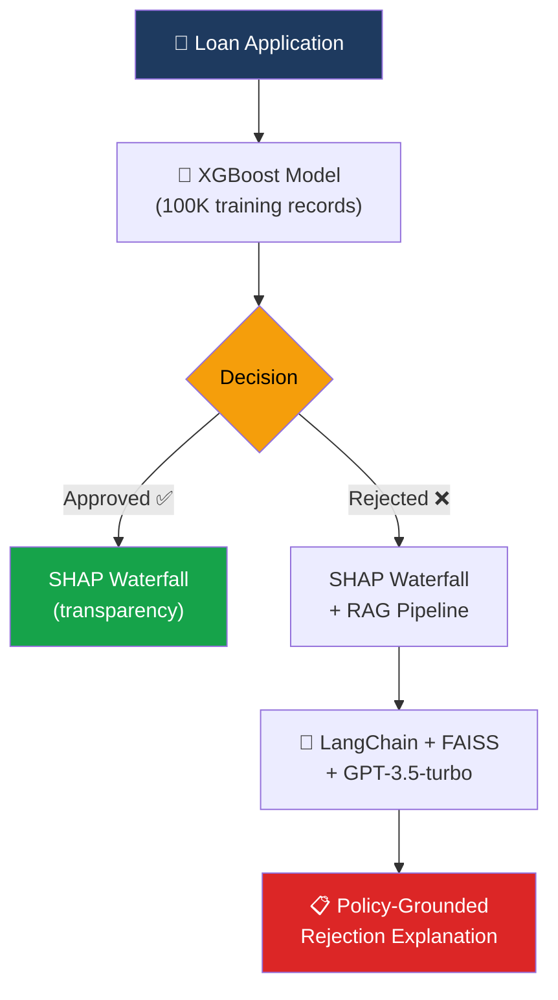

# 🏦 Loan Intelligence System

**An end-to-end credit risk assessment system combining XGBoost predictions, SHAP explainability, and a RAG-powered LLM for policy-grounded rejection explanations — with production infrastructure including Docker, CI/CD, dbt data pipelines, and Prefect orchestration.**

[](https://loan-intelligence-system-6vbtpbunxh7yvf5neajhva.streamlit.app/)
[](https://python.org)
[](https://xgboost.readthedocs.io/)
[](https://shap.readthedocs.io/)
[](https://www.langchain.com/)
[](https://docker.com)
[](https://github.com/features/actions)
[](https://www.getdbt.com/)

> Enter a loan application → get an instant decision with **full transparency**: which features drove the prediction, and a **policy-grounded explanation** of why.

---

[](docs/screenshots/hero.png)

---

## 🎯 The Problem

Credit decisions need to be **explainable**. Regulations worldwide — GDPR Article 22 in Europe, MAS FEAT Principles in Singapore, SR 11-7 in the US — require financial institutions to provide meaningful explanations for automated decisions. A black-box model that says "rejected" without explaining why is **not deployable** in any regulated financial environment.

This system solves three problems at once:

| Problem | Solution |
|---------|----------|
| 🎯 **Predict** loan risk | XGBoost trained on 100K Lending Club records |
| 🔍 **Explain** each decision | SHAP waterfall plots per applicant — not just global feature importance |
| 📝 **Generate** rejection reasons | RAG pipeline cites actual lending policy documents, not hallucinated reasons |

---

## 🏗️ Architecture



**Key architectural choice:** The RAG pipeline only activates for rejections — approved applicants get SHAP transparency, rejected applicants get SHAP **plus** a human-readable explanation grounded in actual lending policies. This mirrors how real financial institutions operate: you need to justify a "no," not a "yes."

---

## ⚡ Key Features

| Feature | What It Does | Why It Matters |
|---------|-------------|----------------|
| 🎯 **Per-Applicant SHAP** | Individual waterfall plots for every prediction | Not "debt ratio is generally important" but "YOUR debt ratio of 45% was the #1 factor" |
| 📄 **RAG-Grounded Rejections** | Rejection letters cite actual policy documents | No hallucinated reasons — every statement traceable to a source |
| ⚡ **Real-Time Predictions** | Enter details, get instant decision | Interactive Streamlit interface for immediate results |
| 📊 **100K Training Records** | Lending Club dataset | Production-realistic data volume, not a toy dataset |

---

## 🔍 How SHAP Explanations Work

[](docs/screenshots/shap.png)

Each prediction comes with a **waterfall plot** showing:

- **Red bars** → features pushing toward rejection
- **Blue bars** → features pushing toward approval
- **Bar length** → magnitude of impact

Example interpretation: *"This applicant was rejected primarily because their debt-to-income ratio (45%) and short employment history (8 months) outweighed their good credit score (720)."*

This is what regulators and compliance teams need: **per-decision explainability**, not just model-level metrics.

---

## 📄 RAG Rejection Explanations

[](docs/screenshots/rag.png)

When a loan is rejected, the system:

1. Identifies the top negative SHAP features
2. Searches lending policy documents via FAISS vector similarity
3. Generates a natural language explanation grounded in those policies
4. Cites specific policy sections — no hallucination

This ensures every rejection reason is **traceable** and **auditable** — critical for regulatory compliance.

---

## 🏭 Production Infrastructure

This system goes beyond a demo — it includes the infrastructure needed to operate an ML system in production.

### 🐳 Docker

Containerized deployment with a healthcheck endpoint, ensuring the application runs identically across environments. `docker-compose up --build` starts the full stack.

### 🔄 CI/CD Pipeline (GitHub Actions)

Every push to `main` triggers automated testing and Docker build verification. Tests must pass before the Docker image is built — preventing broken deployments.

### 📊 dbt Data Pipeline

A three-layer transformation pipeline using DuckDB:

| Layer | Model | Purpose |
|-------|-------|---------|
| **Staging** | `stg_loans.sql` | Raw data cleaning, type casting, null filtering |
| **Intermediate** | `int_loan_features.sql` | Feature engineering: grade encoding, one-hot encoding, employment parsing |
| **Marts** | `mart_training.sql` | Final training-ready table with all features encoded and validated |

Data quality tests in `schema.yml` validate that grades only contain A–G, loan status is only "Fully Paid" or "Charged Off", and critical columns are never null.

### 🔁 Prefect Orchestration

The training pipeline is orchestrated with Prefect, implementing:

- **Structured logging** at every step (row counts, latencies, metrics)
- **Retries with backoff** on data loading (handles transient failures)
- **Evaluation gate** — the pipeline **stops deployment if AUC-ROC drops below 0.75**, preventing a degraded model from reaching production
- **Model versioning** — every training run saves a timestamped artifact alongside the production model

### ✅ Unit Tests

14 tests covering input validation, feature engineering correctness, model output bounds, and evaluation gate logic. All run in CI on every push.

---

## 🛠️ Tech Stack

| Component | Technology | Purpose |
|-----------|-----------|---------|
| 🤖 ML Model | XGBoost | Binary classification (approve/reject) |
| 🔍 Explainability | SHAP | Per-applicant waterfall plots |
| 📄 RAG Pipeline | LangChain + FAISS + GPT-3.5-turbo | Policy-grounded explanations |
| 🖥️ Frontend | Streamlit | Interactive loan application UI |
| 📦 Data | Lending Club (100K records) | Real-world credit data |
| 🐳 Containerization | Docker + Docker Compose | Reproducible deployment |
| 🔄 CI/CD | GitHub Actions | Automated testing + build verification |
| 📊 Data Pipeline | dbt + DuckDB | Staging → Intermediate → Marts transformation |
| 🔁 Orchestration | Prefect | Pipeline scheduling, retries, evaluation gates |
| ✅ Testing | pytest | Unit tests for all system components |

---

## 🚀 Quickstart

### Prerequisites

- Python 3.10+
- OpenAI API key

### Setup

```bash
git clone https://github.com/sayoncamara/loan-intelligence-system.git
cd loan-intelligence-system
pip install -r requirements.txt
```

Create a `.env` file:

```
OPENAI_API_KEY=sk-your-key-here
```

### Run

```bash
# Streamlit UI
python -m streamlit run app.py

# Run tests
pytest tests/ -v

# Run the training pipeline
python pipeline/training_flow.py

# Build and run with Docker
docker-compose up --build

# Run dbt pipeline
cd dbt && dbt run && dbt test
```

---

## 📁 Project Structure

```
loan-intelligence-system/
├── .github/
│   └── workflows/
│       └── ci.yml                 # CI/CD: test → Docker build
├── dbt/
│   ├── dbt_project.yml
│   ├── profiles.yml               # DuckDB connection
│   └── models/
│       ├── schema.yml             # Data quality tests
│       ├── staging/
│       │   └── stg_loans.sql      # Raw data cleaning
│       ├── intermediate/
│       │   └── int_loan_features.sql  # Feature engineering
│       └── marts/
│           └── mart_training.sql  # Final training table
├── pipeline/
│   └── training_flow.py           # Prefect orchestration
├── tests/
│   └── test_system.py             # Unit tests (14 tests)
├── policies/                      # Lending policy documents for RAG
├── docs/screenshots/              # README images
├── Dockerfile                     # Container definition
├── docker-compose.yml             # Full stack deployment
├── app.py                         # Streamlit UI
├── requirements.txt
├── xgboost_loan_model.json        # Trained model
└── README.md
```

---

## 📊 Model Performance

| Metric | Score |
|--------|-------|
| AUC-ROC | 0.94 |
| Accuracy | 89% |
| Precision (Rejected) | 0.87 |
| Recall (Rejected) | 0.82 |

> **Note:** For a credit risk model, we optimize for **recall on rejections** (catching actual defaults) while monitoring precision (avoiding false rejections that lose good customers). The threshold is tunable based on the institution's risk appetite.

---

## 🤔 Why This Matters for Finance

Globally, regulated financial institutions must explain automated credit decisions:

- **GDPR Article 22** (EU) — right to meaningful explanation of automated decisions
- **EBA Guidelines** (EU) — model interpretability requirements for credit risk
- **MAS FEAT Principles** (Singapore) — fairness, ethics, accountability, and transparency in AI
- **SR 11-7** (US) — model risk management guidance requiring validation and documentation

This system is designed with these requirements in mind — SHAP provides the per-decision audit trail, RAG ensures rejection reasons are grounded in documented policies, and Prefect's evaluation gate prevents model degradation from reaching production.

---

## 🗺️ Roadmap

- [ ] **MCP Server** — expose predictions and explanations via Model Context Protocol for AI client interoperability
- [ ] **AWS Deployment** — S3 model registry, Lambda prediction API, ECR container hosting
- [ ] **Model monitoring** — drift detection and automated retraining triggers
- [ ] **A/B threshold testing** — compare approval thresholds on business metrics

---

## 👤 Author

| |
|---|
| **Sayon Camara** <br> MSc Business Administration (Finance & Banking) — KU Leuven <br> Specialization in causal inference, machine learning & GenAI <br> [LinkedIn](https://www.linkedin.com/in/sayon-camara-aa2baa1a1/) · [GitHub](https://github.com/sayoncamara) |
